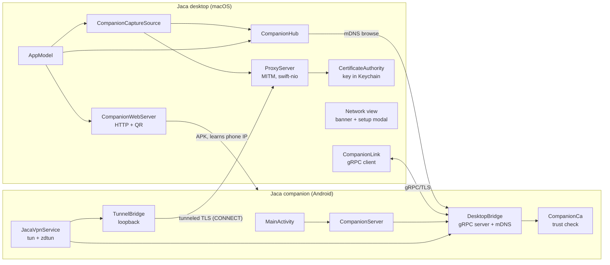
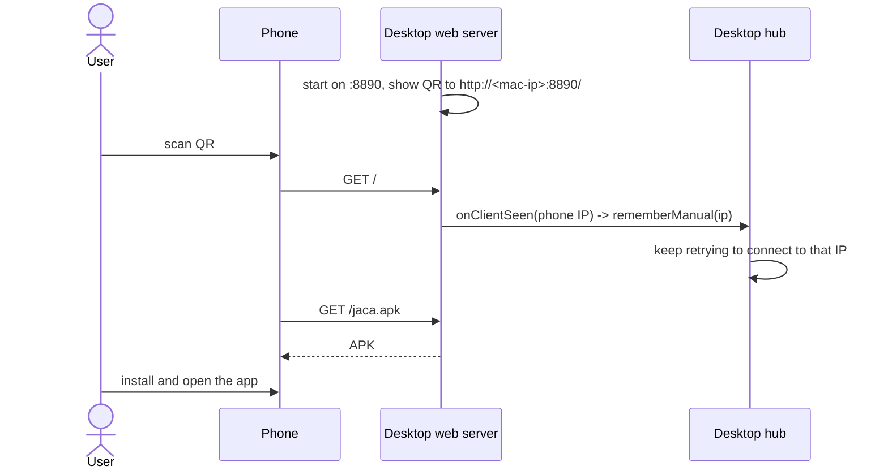
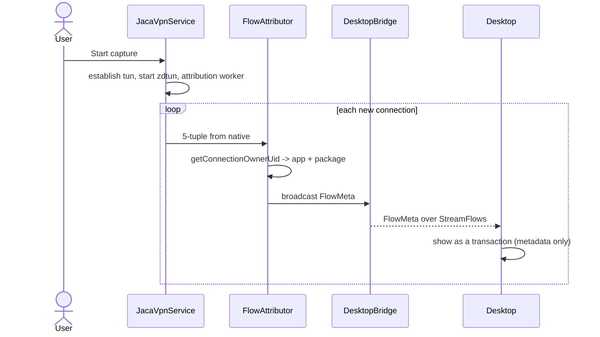
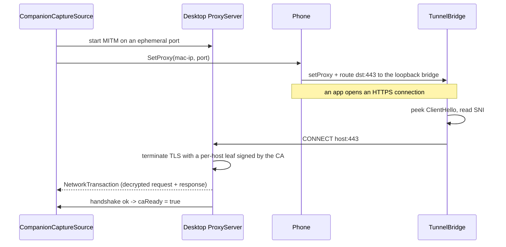
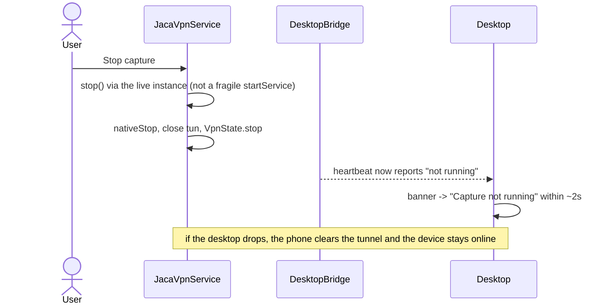
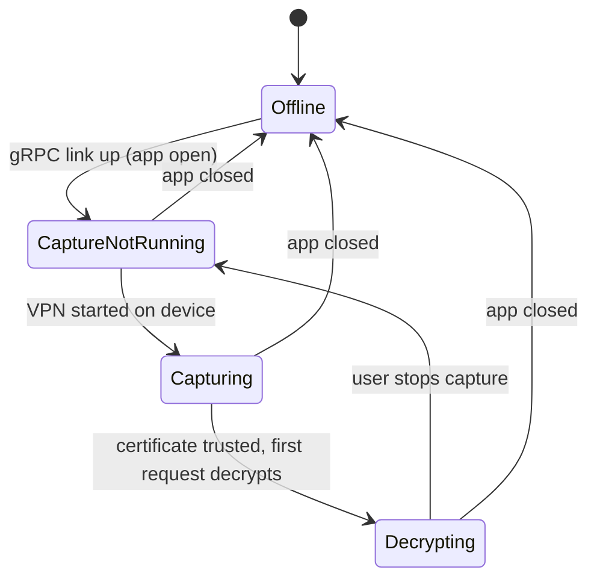

# Companion capture: communication architecture

How the Jaca desktop app and the Jaca companion app on a phone talk to each other, from
the first QR scan to decrypted traffic on screen. Decryption happens on the desktop. The
CA private key never leaves the Mac.

This is a living document. When the flow or the wire protocol changes, update the diagrams
and the step list here in the same change. Last updated: 2026-06-15.

## The two sides

The desktop is the macOS SwiftUI app. It discovers phones on the LAN, opens a connection to
each one, runs the MITM proxy that decrypts TLS, and shows the captured traffic.

The phone is a Compose Multiplatform app (`mobile/`, package `dev.srsouza.jaca`). It captures
all of the device's traffic with a `VpnService` plus a userspace TCP/IP stack, attributes
each connection to the app that made it, and streams that to the desktop. For HTTPS it
forwards the intercepted connection to the desktop proxy so the desktop can decrypt it.

The phone is the gRPC server and the desktop is the gRPC client. That is backwards from how
people usually picture it, and it matters: the desktop reaches out to the phone, not the
other way around.

## Channels between them

| Channel | Transport | Direction | Purpose |
|---|---|---|---|
| Onboarding | HTTP, port 8890 | phone fetches from desktop | Serve the APK. The fetch reveals the phone's IP. |
| Discovery | mDNS, `_jaca._tcp` | phone advertises, desktop browses | Find the phone. The TXT record carries a stable device id. |
| Control + flows | gRPC over TLS (HTTP/2), port 8889 | desktop calls the phone | Describe, stream flow metadata, set the proxy, push the CA. |
| Decryption tunnel | TCP with an HTTP CONNECT preface | phone connects to the desktop proxy | The phone hands intercepted TLS to the desktop to decrypt. |

## Components



## Security model

The CA private key is generated once per Mac and stored in the macOS Keychain. It signs a
per-host leaf certificate on the fly when the proxy terminates a TLS connection. It is never
sent to the phone.

The gRPC link runs over TLS so it cannot be read passively on the LAN. The phone is the TLS
server; its key lives in the Android Keystore. The desktop accepts that certificate without
checking a chain, because the goal of this link is confidentiality, not identity. The CA the
user installs is what authenticates decrypted app traffic.

Decryption happens on the desktop. The phone forwards each intercepted HTTPS connection to
the desktop proxy, which terminates the TLS, reads the plaintext, and forwards it upstream.

Jaca's own traffic is excluded from capture (the VPN disallows the app's own package, and the
desktop drops flows whose host is this Mac), so the tool does not record itself.

## Step by step

### 1. Onboarding

The desktop hosts the APK and shows a QR code that points at it. When the phone fetches
anything from that server, the desktop records the phone's IP and starts trying to reach it.



The web page only serves the app. There is no certificate download on it. The certificate is
handled inside the app later (see step 3).

### 2. Discovery and connect

The phone starts its gRPC server the moment the app opens, before any capture, so the desktop
can set things up first. The desktop finds the phone over mDNS and opens the connection.

```mermaid
sequenceDiagram
  participant Phone as Phone (DesktopBridge)
  participant Hub as Desktop hub
  participant Link as Desktop gRPC client

  Phone->>Phone: app open -> CompanionServer.acquire -> start gRPC/TLS on :8889
  Phone->>Phone: register mDNS _jaca._tcp with TXT id=<stable UUID>
  Hub->>Hub: browse _jaca._tcp, read TXT id
  Hub->>Link: connect(id, endpoint)
  Link->>Phone: resolve address, open gRPC channel
  Link->>Phone: Describe()
  Phone-->>Link: DeviceInfo(name, ip, version)
  Link->>Phone: StreamFlows()  (stays open)
  loop every ~2s and on connect
    Phone-->>Link: capture heartbeat (running or not)
  end
```

The device is keyed by the stable id from the TXT record, not by its IP. See "Identity and
reconnects" below for why that matters.

### 3. Certificate setup

As soon as the desktop connects, it pushes the CA to the phone. The phone stores it, checks
whether it is already trusted, and shows the result. The user installs it with one tap, and
the app confirms on its own.

```mermaid
sequenceDiagram
  participant Link as Desktop
  participant Phone as Phone (DesktopBridge)
  participant Cert as CompanionCa
  actor User

  Link->>Phone: InstallCa(pem)   (on connect)
  Phone->>Cert: store(pem)
  Cert->>Cert: persist + check AndroidCAStore
  Cert-->>Phone: caReceived=true, caTrusted=?
  alt not trusted yet
    Phone->>User: show "Install certificate"
    User->>Phone: tap install -> stage to Downloads, open Settings
    User->>Phone: confirm in Settings
    Phone->>Cert: re-check on resume / on a short poll
    Cert-->>Phone: caTrusted=true
  end
```

Two facts worth knowing. Android 11 and newer block an app from installing a CA without a
trip through Settings, so the one tap into Settings is the floor for a non-rooted device.
Apps that target API 24 and newer only trust user-installed CAs if they opt in, so a
user-store install covers browsers and opted-in apps; full coverage still needs a rooted
system-store install.

### 4. Capture and attribution

Capture is a `VpnService`. The native userspace TCP/IP stack (zdtun) terminates each
connection and forwards it through a protected socket, so the device stays online even on an
emulator. Every new connection is attributed to its app and streamed to the desktop as
metadata, before any decryption.



### 5. Decryption

When a capture session opens on the desktop, it starts the MITM proxy and tells the phone
where it is. The phone routes port 443 through a loopback bridge, peeks the SNI, and forwards
the connection to the desktop proxy. The proxy terminates the TLS with a leaf signed by the
CA and reads the plaintext.



If the phone cannot reach the desktop proxy, the tunnel falls back to a direct connection, so
traffic still flows even when decryption is not set up.

### 6. Stopping capture

Stopping tears down the VPN on the device. The desktop notices through the heartbeat and
through the stream ending.



## What the desktop shows

The network view shows a live status for a companion device. It comes from three signals: the
gRPC link (is the app reachable), the capture heartbeat (is the VPN running), and the first
decrypted request (is the CA trusted).



The same three signals drive the guided setup modal, which auto-opens once when you open a
device that is not decrypting yet.

## Identity and reconnects

The phone advertises a stable per-install UUID in its mDNS TXT record. The desktop keys each
device by that UUID, so a phone that drops off Wi-Fi and comes back on a new IP is still one
entry. The desktop re-resolves the address whenever the device reappears and reconnects to it.
The desktop only remembers devices by this id, never by an address, so the list does not fill
with stale IP rows.

Emulators are the exception. mDNS does not cross the emulator NAT, so an emulator is reached by
IP through the onboarding path, and its (stable) IP is used directly.

## Capture state heartbeat

The gRPC link being up means the app is open. It does not mean capture is running. To tell
them apart, the phone sends a small heartbeat over the flow stream: a sentinel flow whose host
field is "1" while the VPN is up and "0" when it is not, every couple of seconds and once
right after the desktop connects. The desktop filters it out of the flow list and uses it to
drive the "Capture not running" state and to notice within about two seconds when the user
stops capture.

## Not done yet

- The setup walkthrough video is a placeholder. `TutorialVideo.url` is nil until a clip is
  added to `Resources/`, at which point both the proxy and companion setup sheets show it.
- The on-device store and lazy fetch idea (keep raw traffic on the phone, fetch detail on
  demand) is deferred. See [on-device-store-and-lazy-fetch.md](on-device-store-and-lazy-fetch.md).
- Decryption coverage on non-rooted devices is limited by Android's user-CA trust rules.

## Where each piece lives

Desktop:
- `Sources/Core/Companion/CompanionWebServer.swift` (onboarding HTTP + QR)
- `Sources/Core/Companion/CompanionLink.swift` (gRPC client, discovery, heartbeat)
- `Sources/Core/Companion/CompanionHub.swift` (connections + per-device state)
- `Sources/Core/Capture/CompanionCaptureSource.swift` (flows + proxy wiring)
- `Sources/Core/Network/ProxyServer.swift`, `CertificateAuthority.swift` (MITM + CA)
- `Sources/Features/Network/NetworkSessionView.swift`, `CompanionCASheet.swift` (status + modal)
- `Sources/Model/AppModel.swift`, `NetworkSession.swift` (orchestration + session state)

Phone (`mobile/composeApp/src/androidMain/.../jaca/`):
- `CompanionServer.kt`, `DesktopBridge.kt` (gRPC server, mDNS, heartbeat, InstallCa)
- `JacaVpnService.kt` + `jni/` (tun + zdtun), `TunnelBridge.kt` (loopback tunnel)
- `CompanionCa.kt` (CA store + trust check), `CompanionId.kt` (stable id), `CompanionTls.kt`

Contract: `proto/companion.proto`.
